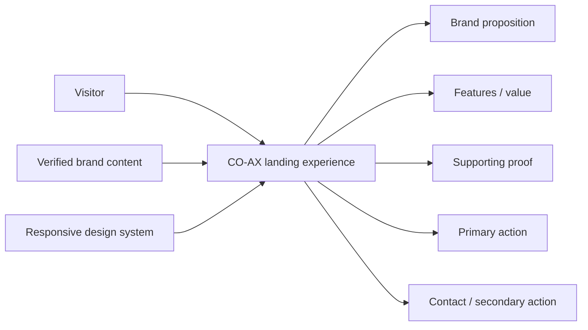
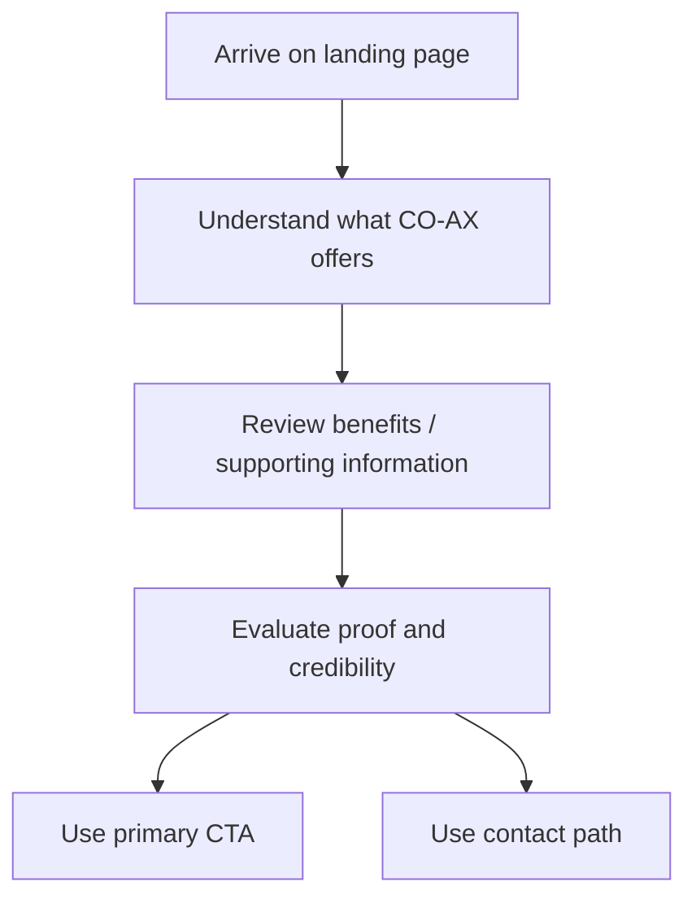
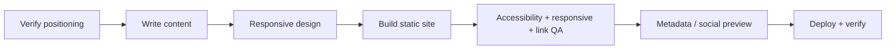

<div align="center">

# ⚡ CO-AX

**A concept-brand landing-page repository for shaping a clear proposition, focused calls to action, responsive presentation, and maintainable future frontend implementation.**


[Repository overview](./docs/REPOSITORY_OVERVIEW.md) · [Detailed docs](./docs/README.md) · [Issues](https://github.com/Nischhalsubba/CO-AX/issues)

</div>

## Overview

CO-AX is retained as a **brand and landing-page concept repository**. The historical HTML/CSS/JavaScript implementation is not present on the current branch, so this README documents the intended experience without pretending a runnable website currently exists.

| Audience | Focus |
|---|---|
| Designers | Brand hierarchy, landing-page composition, responsive states and visual consistency |
| Developers | Small, dependency-light future implementation with clear source ownership |
| Content / marketing | Proposition, proof, features, CTA language and metadata |
| Stakeholders | Intended journey, implementation status and launch verification |

<details open>
<summary><strong>🏗️ Interactive website architecture</strong></summary>



</details>

## Visitor flow



## Current repository structure

```text
CO-AX/
├── docs/
│   ├── assets/
│   ├── REPOSITORY_OVERVIEW.md
│   └── README.md
├── LICENSE
└── README.md
```

There is no runnable application on the current branch. If the site is rebuilt, keep the source proportional to the product rather than manufacturing an impressive forest of empty directories.

## Suggested future source shape

```text
src/
├── index.html
├── styles/main.css
├── scripts/main.js
└── assets/
```

## Design and implementation principles

- Make the proposition obvious within the first screen.
- Keep CTA hierarchy predictable and accessible.
- Use semantic HTML, keyboard-friendly interactions and visible focus states.
- Keep JavaScript focused on real interaction needs.
- Verify responsive behavior and filename/path casing before release.
- Do not invent customers, performance metrics, testimonials or deployment status.

## SEO and discoverability

When a real CO-AX product or service definition exists, use accurate terms from that verified positioning in the page title, description, headings and copy. A landing page should pair **brand name, product/service category, customer problem, core benefit and location or market context** only where those facts are known. Avoid keyword stuffing or business claims unsupported by the repository.

## Delivery flow



See [`docs/README.md`](./docs/README.md) and [`docs/REPOSITORY_OVERVIEW.md`](./docs/REPOSITORY_OVERVIEW.md) for retained project context.
