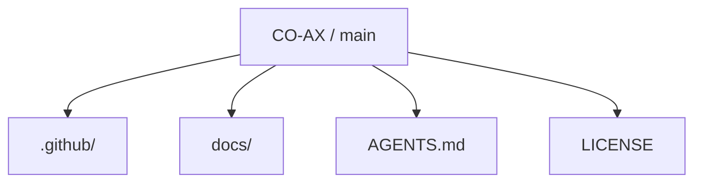
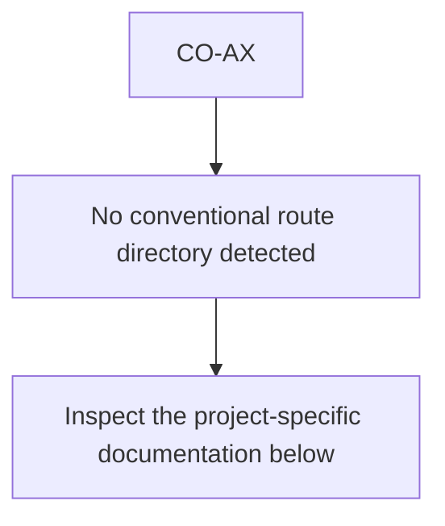
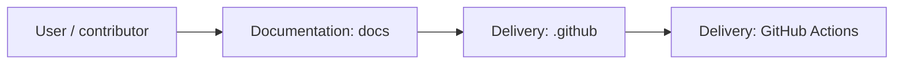
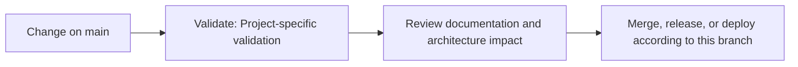

<div align="center">

# CO-AX

<!-- interactive-readme-standard:start -->

> [!NOTE]
> **Branch-specific documentation:** this section is maintained for [`main`](https://github.com/Nischhalsubba/CO-AX/tree/main). It is generated from the files present on this branch and preserves the project-authored README below.

<details open>
<summary><strong>Interactive repository guide</strong></summary>

## Branch overview

| Item | Value |
|---|---|
| Repository | [`Nischhalsubba/CO-AX`](https://github.com/Nischhalsubba/CO-AX) |
| Branch | [`main`](https://github.com/Nischhalsubba/CO-AX/tree/main) |
| Detected stack | No primary framework detected automatically |
| Detected manifests | No standard manifest detected |
| Documentation policy | Every maintained branch must explain purpose, setup, structure, architecture, flows, testing, delivery, security, and ownership. |

## Repository structure



The diagram is generated from the branch's actual top-level files and directories. Use the branch link above for complete source navigation.

## Website or application structure



## Application and responsibility flow



## Change-to-delivery flow



## README requirements for this branch

- Explain what this branch contains and how it differs from the default branch.
- Keep installation, configuration, usage, testing, deployment, security, support, and license information accurate.
- Document repository, website or application, API, data, authentication, background-job, and deployment flows when they exist.
- Prefer Mermaid diagrams and expandable `<details>` sections for visual navigation.
- Link diagrams and modules to real source paths; never invent missing components.
- Preserve project-specific documentation and update diagrams whenever architecture or major paths change.
- Treat secrets, private infrastructure, customer data, and credentials as prohibited README content.

</details>

<!-- interactive-readme-standard:end -->

### Concept Brand Landing Page

**A static landing page for a concept brand named CO-AX, built to present a hero message, feature/service highlights, and a clear contact or subscription CTA.**


</div>

---

## ✨ Overview

**CO-AX** is a simple concept-brand landing page. It introduces the brand, highlights products or services, and provides a contact or subscription path.

---

## 🎯 Purpose

This repo can be used for:

- startup landing page
- product teaser page
- brand concept page
- campaign landing page
- lightweight static website practice

---

## 🧱 Core Sections

| Section | Purpose |
|---|---|
| Hero | Brand tagline and primary CTA |
| Features | Products, services, or value points |
| Contact | Inquiry/subscription action |
| Footer | Secondary links and copyright |

---

## 🛠 Tech Stack

| Layer | Technology |
|---|---|
| Markup | HTML |
| Styling | CSS |
| Interaction | JavaScript |

---

## 🚀 Run Locally

Clone the repo and open the main HTML file in your browser.

```bash
git clone https://github.com/Nischhalsubba/CO-AX.git
```

---

## ✅ Quality Checklist

- [ ] Brand message is clear.
- [ ] CTA link works.
- [ ] Images are optimized.
- [ ] Mobile layout is readable.
- [ ] SEO title and description are added.
- [ ] Placeholder text is removed.

---

<div align="center">

A clean static foundation for a concept brand website.

</div>
