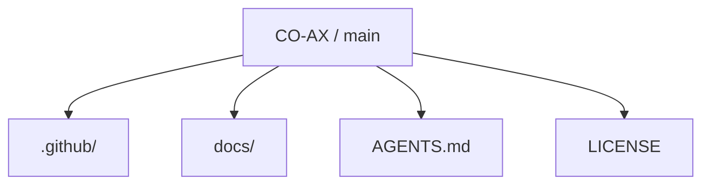
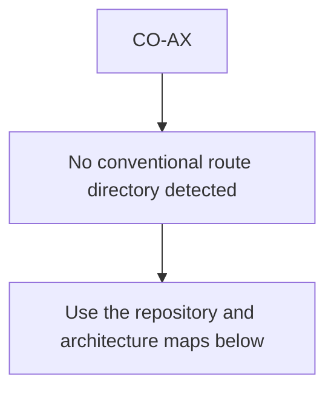
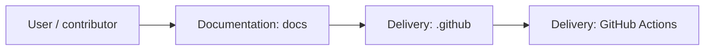
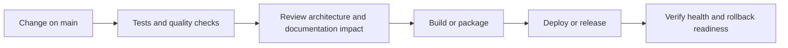
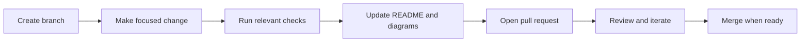

<!-- interactive-readme-standard:start -->

<div align="center">

# CO-AX

**Branch-aware technical guide for [`main`](https://github.com/Nischhalsubba/CO-AX/tree/main)**

<p>  </p>

<p>
  <a href="https://github.com/Nischhalsubba/CO-AX/tree/main"><strong>Browse source</strong></a> ·
  <a href="https://github.com/Nischhalsubba/CO-AX/issues"><strong>Issues</strong></a> ·
  <a href="https://github.com/Nischhalsubba/CO-AX/codespaces/new?ref=main"><strong>Open in Codespaces</strong></a>
</p>

</div>

> [!IMPORTANT]
> This guide is generated from the files actually present on `main`. It links to detected source paths, preserves project-authored notes, and avoids claiming components that were not found.

## At a glance

| Item | Detected value |
|---|---|
| Purpose | Branch-specific project documentation generated from the repository structure without inventing missing capabilities. |
| Branch role | Default branch |
| Stack | No primary framework detected automatically |
| Manifests | No standard manifest detected |
| Prerequisites | Confirm from the detected manifests |
| Delivery | GitHub Actions |
| License | LICENSE |

## Branch scope

This is the repository's default branch.


## Quick start

> No reliable setup command was detected. Use the preserved project-authored notes and manifests rather than guessing.

### Configuration surface

- No committed environment example file was detected.

> Never commit secrets, private keys, production credentials, customer data, or unredacted infrastructure details.

## Repository map



| Responsibility | Detected source paths |
|---|---|
| Documentation | [`docs`](https://github.com/Nischhalsubba/CO-AX/tree/main/docs) |
| Delivery | [`.github`](https://github.com/Nischhalsubba/CO-AX/tree/main/.github) |

## Website or application map



## Architecture and responsibility flow




## Quality, security, and operations

<table>
<tr>
<td width="33%" valign="top">

### Quality

- No conventional test directory was detected automatically.

Detected commands:
- No standard quality command detected.

</td>
<td width="33%" valign="top">

### Security

- No dedicated security policy or automated dependency configuration was detected.

Review authentication, authorization, input validation, dependency updates, secret handling, and failure recovery before release.

</td>
<td width="34%" valign="top">

### Observability

- No dedicated observability integration was detected automatically.

Define useful logs, metrics, traces, alerts, and rollback signals for production-facing branches.

</td>
</tr>
</table>

## Delivery flow



### Automation detected

- [`.github/workflows/apply-interactive-readme.yml`](https://github.com/Nischhalsubba/CO-AX/blob/main/.github/workflows/apply-interactive-readme.yml)

## Contribution flow



- Keep changes focused and explain architectural consequences.
- Run the checks relevant to the changed area.
- Update diagrams whenever routes, modules, data models, authentication, jobs, or delivery paths change.
- Add screenshots or recordings for visual behavior changes when useful.
- Use issues for reproducible defects and pull requests for reviewable changes.

## Ownership and support

| Topic | Source |
|---|---|
| Repository | [`Nischhalsubba/CO-AX`](https://github.com/Nischhalsubba/CO-AX) |
| Branch | [`main`](https://github.com/Nischhalsubba/CO-AX/tree/main) |
| Ownership | No CODEOWNERS file detected |
| Contributing | Use the contribution flow above |
| Support | [Open or review issues](https://github.com/Nischhalsubba/CO-AX/issues) |
| License | [`LICENSE`](https://github.com/Nischhalsubba/CO-AX/blob/main/LICENSE) |

<details>
<summary><strong>Documentation maintenance checklist</strong></summary>

- [ ] Purpose and branch scope are accurate.
- [ ] Setup and configuration commands still work.
- [ ] Repository, application, API, data, authentication, job, and deployment diagrams match the code.
- [ ] Tests, security controls, observability, and rollback behavior are documented.
- [ ] Links point to real files on this branch.
- [ ] No secrets or private operational details are exposed.

</details>

<!-- interactive-readme-standard:end -->

<!-- project-authored-notes:start -->
<details>
<summary><strong>Project-authored notes preserved from this branch</strong></summary>

<div align="center">

# CO-AX

### Concept Brand Landing Page

**A static landing page for a concept brand named CO-AX, built to present a hero message, feature/service highlights, and a clear contact or subscription CTA.**


</div>

---

## ✨ Overview

**CO-AX** is a simple concept-brand landing page. It introduces the brand, highlights products or services, and provides a contact or subscription path.

---

## 🎯 Purpose

This repo can be used for:

- startup landing page
- product teaser page
- brand concept page
- campaign landing page
- lightweight static website practice

---

## 🧱 Core Sections

| Section | Purpose |
|---|---|
| Hero | Brand tagline and primary CTA |
| Features | Products, services, or value points |
| Contact | Inquiry/subscription action |
| Footer | Secondary links and copyright |

---

## 🛠 Tech Stack

| Layer | Technology |
|---|---|
| Markup | HTML |
| Styling | CSS |
| Interaction | JavaScript |

---

## 🚀 Run Locally

Clone the repo and open the main HTML file in your browser.

```bash
git clone https://github.com/Nischhalsubba/CO-AX.git
```

---

## ✅ Quality Checklist

- [ ] Brand message is clear.
- [ ] CTA link works.
- [ ] Images are optimized.
- [ ] Mobile layout is readable.
- [ ] SEO title and description are added.
- [ ] Placeholder text is removed.

---

<div align="center">

A clean static foundation for a concept brand website.

</div>

</details>
<!-- project-authored-notes:end -->
