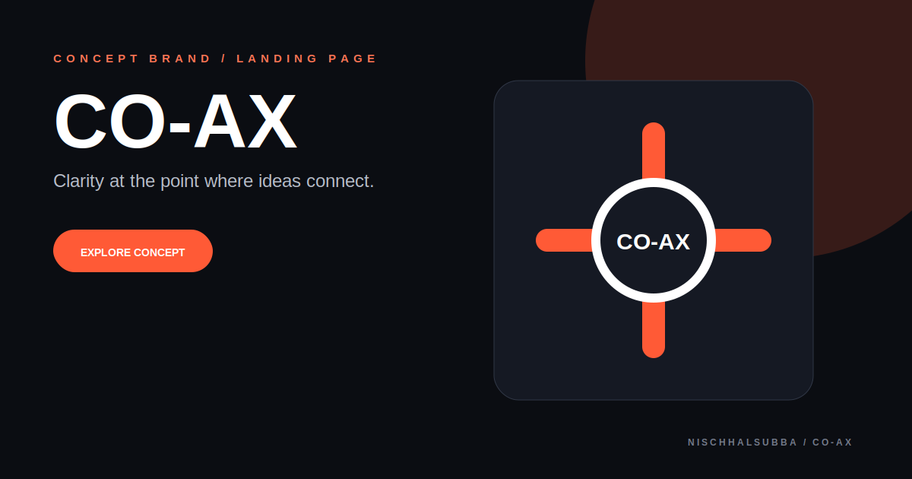

# CO-AX Repository Overview

## Classification

CO-AX is a small static concept-brand landing page. It should be evaluated as a brand and frontend exercise, not as a deployed startup or production product.

- Runtime: browser-served HTML, CSS, and JavaScript
- Deployment: not verified
- Fresh browser screenshot: unavailable because public hosts could not be resolved
- Repository visual: original concept thumbnail, not a runtime screenshot

## Verification priorities

1. Confirm the entry HTML and asset paths.
2. Replace placeholder brand copy and links.
3. Test responsive behavior and CTA actions.
4. Add metadata, favicon, and Open Graph information.
5. Review keyboard access, focus, contrast, and reduced motion.